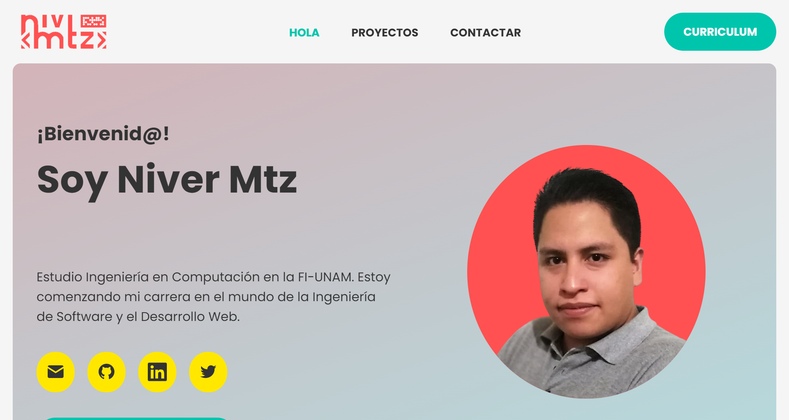

  

# Portafolio de Niver

Puedes verlo aquí: https://nivermtz.github.io/portfolio/

## 🔍 Vistas 

### 💻 Desktop

  

### 📱 Mobile

  
  
  

## 📌 Stack

Proyecto creado con:
* HTML 5
* CSS 3
* JS (ES8)

## 🌟 Autor

* **Niver Mtz**  - [@NiverMtz](https://github.com/NiverMtz)

> Puedes encontrar más proyectos en
[LeonidasEsteban.com](https://leonidasesteban.com/proyectos/todos) 
