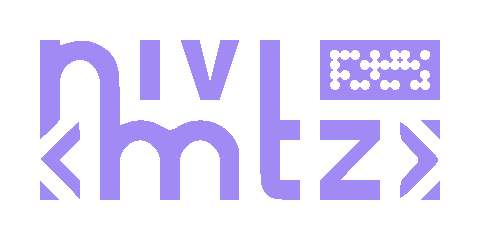
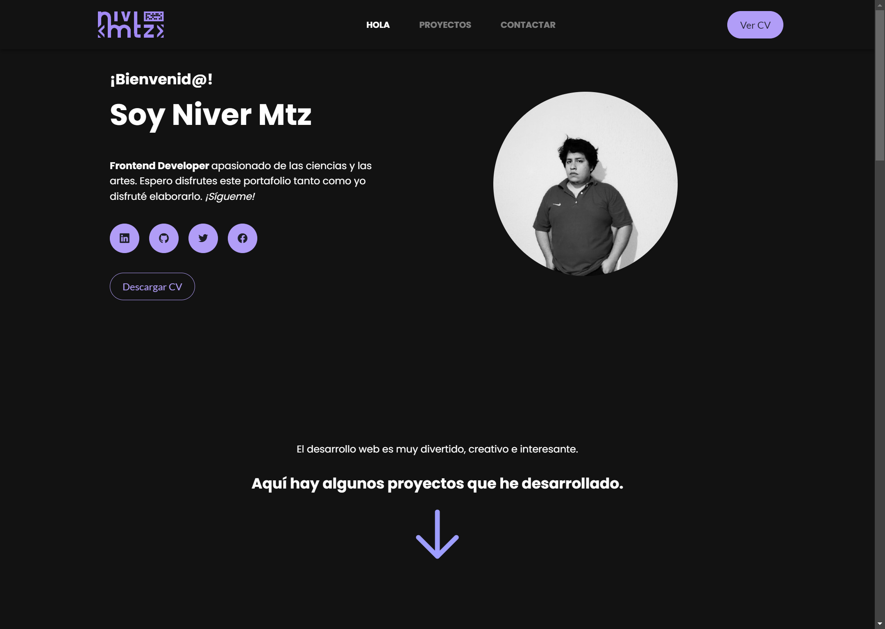
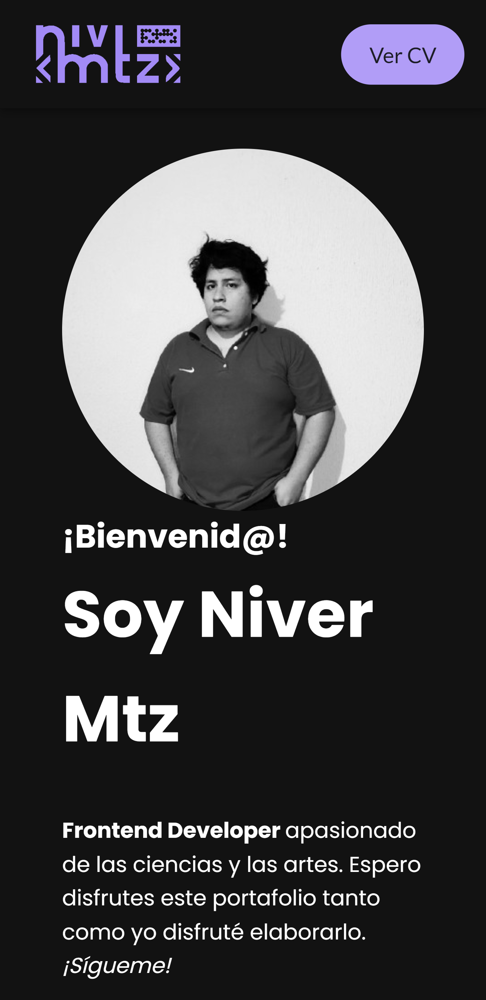

  

# Portafolio de Niver

Puedes verlo aquí: https://nivermtz.dev

## 🔍 Vistas 

### 💻 Desktop

  

### 📱 Mobile

  

## 📌 Stack

Proyecto creado con:
* ANGULAR
* TS
* SCSS
* PRIMENG

Desplegado en **Vercel**. El formulario de contacto usa una función serverless
(`api/contact.ts`) que reenvía a [Formspree](https://formspree.io); el endpoint
`FORMSPREE_ENDPOINT` se configura como *Environment Variable* en Vercel.

### 🤖 Chatbot del portafolio

`api/chat.ts` es una función serverless que consulta la API de Claude
(`claude-haiku-4-5`) con la información del portafolio como contexto
(`api/_knowledge.ts`). Responde solo sobre el perfil y los proyectos de Niver.

Configuración en Vercel:

* `ANTHROPIC_API_KEY` como *Environment Variable* (clave de
  [console.anthropic.com](https://console.anthropic.com)).
* Conviene fijar un **límite de gasto mensual** en la consola de Anthropic; el
  costo con Haiku para tráfico de portafolio es de centavos al mes.

La función limita a 15 mensajes / 10 min por IP y `max_tokens` a 512. Si cambias
proyectos en `src/assets/i18n/es.json`, actualiza también `api/_knowledge.ts`.

## 🌟 Autor

* **Niver Mtz**  - [@NiverMtz](https://github.com/NiverMtz)
